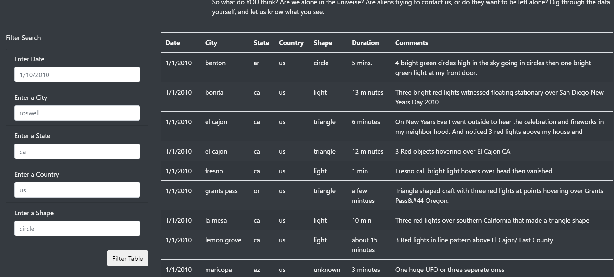

# UFOs

## Project Overview

### Purpose

The purpose of this project is to create an interactive website of UFO sightings using data stored in a dictionary.

## Resources

To build an interactive filter, I created a table from a list of dictionaries containing data on UFO sightings using JavaScript, HTML and CSS.

## Results

The first step to using my new webpage is to scroll to the table portion of the website.

Once you are at the table, simply type in whatever inputs you would like to sort on and then either hit the 'enter' or 'return' key or click into another search filter button. 
The filter is set to update whenever text is entered or removed.

For example, to filter on the date "1/10/2010", all you need to do is put that into the first search filter.

Then, if you would like to filter for events on that day that they took place in Texas, put in the lowercase abbreviation for Texas (tx).

If there is no data contained for that day, the table will show up empty. To return to the full table, either clear out the search fields or refresh the website.

## Summary

Though my design is helpful for visualizing the data, it has room for improvements.

One issue is that information on the website is not updated consistently because it is in a static dictionary. 
It would be helpful to include more recent data so some sort of web scraping would be helpful, that way users could look up recent UFO sightings. 

I also worry that the lack of a button to click on will confuse users.
The group that asked me to build the website stipulated that the inputs would be automatic (no button), but I still think a button might be helpful, even just as a visual way to show that filtering took place.

One mockup of a button might look like this:

Finally, an analysis section showing a map of where UFOs were spotted as well as plots showing the frequency of UFO sightings on certain months or days would also be helpful for users.